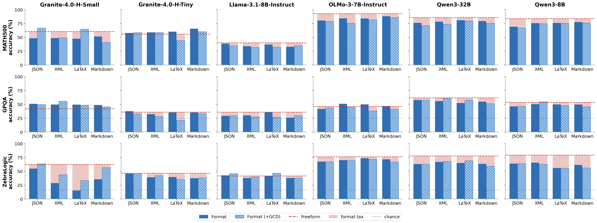

# The Format Tax

[](https://arxiv.org/abs/2604.03616)
[](https://huggingface.co/datasets/ivnle/the-format-tax)



Asking a language model to respond in JSON should be a formatting choice,
not a capability tax. Yet we find that structured output requirements —
JSON, XML, LaTeX, Markdown — substantially degrade reasoning
performance across open-weight models, whether enforced in the prompt or
with grammar-constrained decoding
([Lee, D'Antoni, and Berg-Kirkpatrick, 2026](https://arxiv.org/abs/2604.03616)).

This repo is the code and data for the paper, covering multiple models,
four formats, and three reasoning benchmarks (MATH-500, GPQA, ZebraLogic).
All results are scored by an LLM judge (Qwen3-32B) using task-specific
prompts — see [Judge backends](#judge-backends) for details.

## Contents

- [Examples](#examples) — what the tax looks like at the output level
- [Dataset](#dataset) — per-record data for every model in the figure
- [Quickstart](#quickstart) — reproduce locally with one command
- [Citation](#citation)
- [Reference](#reference) — judge backends, CLI, install notes

## Examples

Three cherry-picked examples from OLMo-3-7B-Instruct on JSON.

### Example 1 — ball-swap probability (MATH500)

> *Bob and Alice each have a bag with one ball of each of 5 colors. Alice
> moves one random ball to Bob; Bob moves one random ball back to Alice.
> What is the probability the bags return to their starting contents?*
>
> Gold: **1/3**

**Freeform** ✓ → `1/3`
> *… After Alice's move, Bob's bag contains his 5 originals plus an extra X
> (**two Xs**, total 6 balls). The probability he picks the extra X is
> **2/6 = 1/3**.*

**Format** (JSON) ✗ → `1/6`
> *… The probability that Bob selects* **the specific ball Alice gave him**
> *from the 6 in his bag is 1/6.*

**Format (+GCD)** ✗ → `1/6`
> *… Bob's 6 balls are his original 4 plus the transferred ball X. Bob must
> select the ball of color X to transfer back in order for the sets to be
> restored.* **There is 1 such ball among 6.**

→ [Full triple: `examples/01-math500-ball-swap.md`](examples/01-math500-ball-swap.md)

### Example 2 — quantum wavefunction normalization (GPQA)

> *The wave function of a particle is ψ(x) = a/√(1 + x) − 0.5·i, defined on
> x ∈ [1, 3]. What is the value of a?*
>
> A) 0.85 &nbsp; B) 0.6 &nbsp; C) 0.35 &nbsp; D) 1.1 &nbsp;&nbsp; Gold: **A**

**Freeform** ✓ → **A**
> *|ψ(x)|² = (a/√(1+x))² + (−½)² =* **a²/(1+x) + 1/4**
> *→ a²·ln 2 + ½ = 1 → a² = 1/(2 ln 2) → a ≈ 0.849.*

**Format** (JSON) ✗ → **D**
> *The modulus squared is |a|²/(1+x)* **since the imaginary part squared is
> irrelevant in magnitude here.**
> *→ a² · ln 2 = 1 → a ≈ 1.2.*

**Format (+GCD)** ✗ → **D**
> *… **Ignoring the imaginary constant (as it does not affect the modulus)**,
> the modulus squared |ψ(x)|² = a²/(1+x).*
> *→ a ≈ 1.202 → closest is D) 1.1.*

→ [Full triple: `examples/02-gpqa-wavefunction.md`](examples/02-gpqa-wavefunction.md)

### Example 3 — 4-house logic puzzle (ZebraLogic)

> *4 houses, 16 clues on names, birthdays, mothers, animals, colors, sports.
> What is the mother of the person in house 3?*
>
> A) Janelle &nbsp; B) Holly &nbsp; C) Kailyn &nbsp; D) Aniya &nbsp;&nbsp; Gold: **A**

**Freeform** ✓ → **A**
> *… From clue 10, Aniya's child is adjacent to Alice (house 3), so Aniya is
> Peter in house 4. From clues 14+15, the swimmer is Holly's child with
> green — that's Eric in house 1.* **That leaves Janelle for Alice.**

**Format** (JSON) ✗ → **B**
> *… House 2's mother is Kailyn (Arnold), so only House 4 remains … Between
> B, A, D.* **Clue 14 links Holly to swimming, perhaps pointing to B. I
> think the answer is B) Holly.**

**Format (+GCD)** ✗ → **D**
> *… Alice likely in 4 (September) … Clue 10: Aniya and Alice (in 4) must
> be adjacent → Aniya in 3. …* **The question is mother of the person in
> house 3 → Aniya. So answer D.**

→ [Full triple: `examples/03-zebralogic-houses.md`](examples/03-zebralogic-houses.md)

In all three cases the error is a reasoning content error — the JSON
`"reasoning"` field compresses multi-step work into a paragraph, and
load-bearing steps get skipped.

## Dataset

```python
from datasets import load_dataset

ds = load_dataset("ivnle/the-format-tax", split="qwen3_8b")
# also: "llama_3_1_8b_instruct", "qwen3_32b", "olmo_3_7b_instruct",
#        "granite_4_0_h_tiny", "granite_4_0_h_small"
```

Each split contains 10,782 records with the rendered prompt, gold answer,
raw model output, and judge verdict for every `(task, format, decoding)`
combination.

## Quickstart

```bash
git clone https://github.com/ivnle/the-format-tax.git
cd the-format-tax
uv sync
python run.py --max-examples 50
```

For machines without 2× 48 GB GPUs, see
[Judge backends](#judge-backends) for the OpenAI batch API alternative.

A full Qwen3-8B run at `temperature=1.0` should land near
**83.6% / 53.5% / 79.2%** freeform on MATH-500 / GPQA / ZebraLogic.

## Citation

```bibtex
@article{lee2026format_tax,
  title={The Format Tax},
  author={Lee, Ivan Yee and D'Antoni, Loris and Berg-Kirkpatrick, Taylor},
  journal={arXiv preprint arXiv:2604.03616},
  year={2026},
  url={https://arxiv.org/abs/2604.03616}
}
```

## Reference

### Judge backends

Accuracy is scored by an LLM judge. Rule-based extraction (regex +
SymPy) required constant patching as each new format and model
introduced edge cases — and missed extractions confound the format
comparison. An LLM judge is imperfect but format-agnostic; spot-
checking disagreements showed the rule-based scorer was usually the
one at fault.

`run.py` takes `--judge-backend {vllm,openai}` (default: `vllm`).

**vLLM (local):**
Loads `Qwen/Qwen3-32B` on two GPUs via `tensor_parallel_size=2` (~64 GB
bf16). No API keys needed.

**OpenAI batch API:**
Uses `gpt-5.4-nano` (override with `--judge-model`). Requires
`OPENAI_API_KEY`. Submits all judge prompts as a single batch job.
Also available standalone via `judge_openai.py` with
`submit` / `poll` / `retrieve` subcommands.

### CLI

```bash
python run.py \
  --tasks math500 gpqa zebralogic \
  --formats freeform json xml latex markdown \
  --decoding prompt gcd \
  --model Qwen/Qwen3-8B \
  --judge-backend vllm \
  --judge-model Qwen/Qwen3-32B \
  --judge-tp 2 \
  --max-examples 50
```

- `--tasks`, `--formats`, `--decoding`: subset filters
- `--model`: generator HF id
- `--judge-backend {vllm,openai}`: judge transport
- `--judge-model`: judge model (defaults to `Qwen/Qwen3-32B` or `gpt-5.4-nano`)
- `--judge-tp`: tensor parallel size for vLLM judge
- `--enable-thinking`: opt into thinking on supported model families
- GPQA requires gated HF access (`HF_TOKEN`)

Output: `results/<model>_<timestamp>.raw.json` (generation) and
`results/<model>_<timestamp>.json` (with judge verdicts).

### Scope

**Reproduces:** the freeform vs. structured-output accuracy drop across
prompt-only and grammar-constrained decoding; the paper's prompt
templates and grammar assets; two judge paths (local vLLM, OpenAI batch
API); three reasoning tasks (MATH-500, GPQA-Diamond, ZebraLogic); the
HF dataset's multi-model hero figure.

**Does not yet reproduce:** the full model sweep from the paper; GAD
methods (SMC, CARS, importance sampling); distribution-shift or
robustness analysis.

### Install notes

`uv sync` resolves the runtime pinned in
[pyproject.toml](pyproject.toml): `vllm==0.19.0`, `openai>=1.50`.

### Extending

- Add a format: one file in `formats/` + one grammar asset per task in `grammars/`.
- Add a task: one file in `tasks/` + task prompt templates and grammar assets.
- Swap models: `--model <hf-id>` and `--judge-model <hf-id>`.
